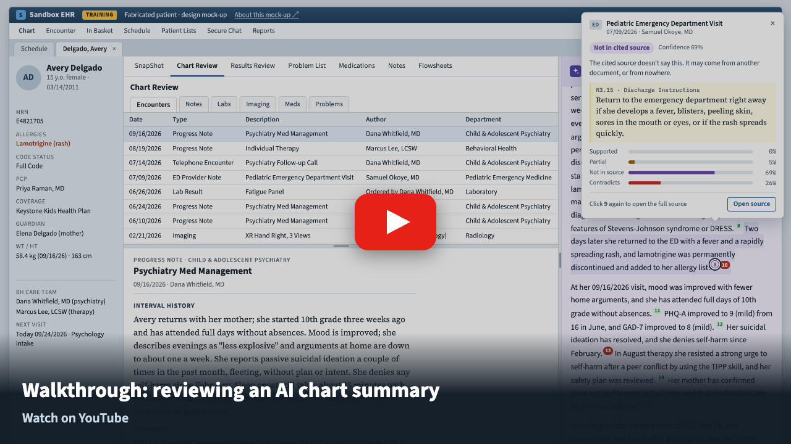

# Chart Summary Verify

**A mock-up of what AI chart summaries could look like if every citation were checked before a clinician read it.**

**Live demo:** https://stephonomon.github.io/chart-summary-verify/

**Video walkthrough:** https://youtu.be/X0LpRQ8ikiA

[](https://youtu.be/X0LpRQ8ikiA)

▶ [Watch Stephon walk through the workflow on YouTube](https://youtu.be/X0LpRQ8ikiA)


> **This is a design concept.** It is not a product, and it is not affiliated with any EHR or AI vendor.
> The patient, the clinicians, and the chart are all fabricated. "Sandbox EHR" is styled to look like a familiar
> EHR so the idea is easy to picture in context. Nothing here is medical advice or a validated clinical tool.

---

## The idea in one minute

AI summaries of the chart are showing up in EHRs, and the better ones already put a citation on each sentence so the
clinician can click back to the source. That's a real step forward, but a citation only shows **where** a sentence
came from. It doesn't show **whether the source actually says it.** To find out, the clinician has to open every
citation and read the source. Almost nobody has time to do that for a 20-sentence summary before a visit.

This mock-up adds two things:

1. **A verification layer.** After the large language model writes the summary, a small **classifier model**
   ([Jev](https://docs.typesafe.ai) from TypeSafe AI) reads each citation's source and answers one fixed question:
   *does this source support this sentence?* Jev doesn't write text. It returns a probability for each answer, so
   the result can be thresholded, audited, and shown as a confidence. Checking all 21 citations on this chart took
   0.6 seconds and cost less than a tenth of a cent ([cost and speed](#cost-and-speed-jev-vs-claude)).
2. **A UI that puts that answer where the clinician is already looking.** The superscript citation number itself
   changes color. Most citations are green, so the eye goes straight to the few that aren't.

| Citation | Meaning |
|---|---|
| 🟩 Green | The cited source supports the sentence |
| 🟨 Amber | Partly supported, or supported with low confidence |
| 🟪 Purple | Not in the cited source (it may be somewhere else in the chart, or nowhere) |
| 🟥 Red | The cited source says something different |

## Try it

1. Open the [live demo](https://stephonomon.github.io/chart-summary-verify/) (or [watch the walkthrough](https://youtu.be/X0LpRQ8ikiA) first). The summary is in the lavender sidebar on the right.
2. **Click a colored number** (try the purple ⁹ and red ¹⁰ in the second paragraph). A preview opens next to it with the
   cited passage, the verdict, a confidence, and the probability for each answer.
3. **Click the same number again.** The full source opens in Chart Review with the cited passage highlighted.
4. **Turn on Advanced** (top of the sidebar) for the details a clinical informaticist or a skeptical reviewer would
   want: counts and filters, a confidence threshold, a whole-chart check, a "better source" suggestion, and the answer
   key showing which sentences were planted errors.

Drag the bars between the panes to resize the sidebar and the document list.

## The example that motivated it: a return precaution that became an event

The patient is Avery Delgado, a fabricated 15-year-old seen in child psychiatry for depression, anxiety, ADHD, and past
self-harm. In July she went to the pediatric ED with a mild rash on day 15 of lamotrigine. She had no fever. The
ED stopped the drug and sent her home with standard instructions:

> *Return to the emergency department right away if she develops a fever, blisters, peeling skin, sores in the mouth or eyes, or if the rash spreads quickly.*

Five days later the psychiatrist's follow-up call documents that the rash was fading, with no fever at any point.

The summary in this demo contains a planted confabulation. It is the kind of error a language model can make when
it reads instructions as history:

> *Two days later she returned to the ED with a fever and a rapidly spreading rash, and lamotrigine was permanently discontinued and added to her allergy list.* ⁹ ¹⁰

The citation even looks right. The cited passage contains *fever*, *rash*, and *spreads*. A clinician skimming the
highlighted text could easily accept it. The classifier doesn't:

| Checked against | Verdict | Confidence |
|---|---|---|
| ⁹ The ED note it cites | Not in cited source | 69% |
| ¹⁰ The follow-up call it cites | Contradicts source ("no fever… at any point") | 96% |
| The whole chart | Contradicted | 99% |


## What it would take for real products

These are the design choices the mock-up argues for:

- **Check every citation, not just display it.** A citation is a claim about the source. Test it automatically.
- **Put the result on the citation.** Color the number itself instead of adding a separate panel or report. Green
  means the clinician can move on.
- **Preview first, full source second.** One click shows the passage and the score. A second click opens the document in
  context, where the clinician already knows how to read it.
- **Tell a wrong citation from a made-up fact.** A sentence can be true but cite the wrong note. Checking against the
  whole chart separates "cite N1.9 instead" from "nothing in the chart says this."
  
- **Name the known failure modes.** The classifier's definition of *contradicted* explicitly includes *turning
  something conditional or planned in the source into something that happened*. That one rule catches both the fever
  confabulation and a sertraline increase that was only being considered.
- **Keep the default view quiet.** A clinician sees the summary and colored numbers. The probabilities, thresholds, and
  audit details are one toggle away.
- **Use a model that fits the job.** Verification is classification, not writing. On this chart the classifier was
  13× faster and about 70× cheaper than Claude Opus 5.5 doing the same check, and gave the same answer every time
  it ran (see below). That makes it realistic to run on every summary, every time.

## Results on this chart

Claude (Opus 5.5) wrote a 17-sentence summary from the chart, and it was accurate. To test the checker, five
sentences were rewritten by hand to contain known errors and two were added, for 19 sentences and 21 citations.

| Sentence | What it says | Planted error | Cited source | Whole chart |
|---|---|---|---|---|
| 2 | Inpatient psychiatric admission in December 2025 | Fabrication | not in source 99% | not found 95% |
| 4 | Bipolar I disorder in her **father** | Misattribution (it's a maternal aunt) | contradicts 100% | contradicted 99% |
| 9 | Returned to the ED with a fever and spreading rash | **Confabulation** from return precautions | not in source 69% / contradicts 96% | contradicted 99% |
| 12 | Suicidal ideation has resolved | Overstatement (passive SI a couple of times this month) | contradicts 89% | ambiguous 72% |
| 14 | No firearms in the home, citing the therapy note | Mis-citation (true, but note N1.9 says it) | not in source 100% | supported 100%, suggests N1.9 |
| 18 | Sertraline increased to 100 mg | Plan stated as done | contradicts 100% / 98% | contradicted 99% |
| 16 | Hand X-ray showed no fracture | None (accurate, added so imaging is represented) | supported 100% | supported 100% |

- **All 6 planted errors were flagged.** The mis-citation was the only one the whole-chart check called supported, which is the right answer.
- **Claude's own sentences:** 11 of 12 citations were green. One was amber: sentence 1 credits the problem list with
  "followed by child and adolescent psychiatry," which the problem list doesn't say. That's a fair partial.
- **Speed:** the demo's 40 classifier calls ran in 2.2 seconds (8 in parallel). Writing the summary took Claude 12.5 seconds.

## Cost and speed: Jev vs Claude

Could a large model do the checking instead? `bench.py` gave the same job to Claude: the whole chart plus all 21
citations in **one** call, with a verdict for each citation and a whole-chart verdict for each sentence. That's the
cheapest realistic way to use an LLM for this. Jev ran two ways: the 40 separate calls behind the demo, and a single
call that sends the chart once with all 40 questions. Each arm ran 3 times.

| Checker | Calls | Time (median) | Cost per summary | Planted errors caught | Extra flags on accurate sentences | Same answer all 3 runs? |
|---|---|---|---|---|---|---|
| **Jev, one call** | 1 | **0.6 s** | **$0.0007** | 6 of 6 | 1 | Yes |
| Jev, 40 calls (demo) | 40 | 2.1 s | $0.0078 | 6 of 6 | 1 | Yes |
| Claude Haiku 4.5 | 1 | 3.8 s | $0.0094 | 5 of 6 | 0–1 | No |
| Claude Opus 5.5 (low effort) | 1 | 7.6 s | $0.047 | 6 of 6 | 3–5 | No |
| Claude Sonnet 5 (low effort) | 1 | 18.8 s | $0.037 | 6 of 6 | 1–2 | No |

What stands out:

- **Jev in one call is the one to deploy.** Sending the chart once instead of 19 times cut input from 186k to 17k tokens
  and time from 2.1 s to 0.6 s, with the same flags. It is **~13× faster and ~70× cheaper than Opus 5.5**, and ~6×
  faster and ~13× cheaper than Haiku. At 1,000 summaries a day, that's about **$0.70 vs $47**.
- **Every model caught the fabrication, the misattribution, the mis-citation, and the plan stated as done.** Haiku
  missed "suicidal ideation has resolved." For the fever confabulation, Haiku and Sonnet flagged the ED-note citation
  but called the follow-up-call citation *supported*, because that note does say lamotrigine was stopped and added to the
  allergy list. Jev and Opus flagged both.
- **The classifier is stable; the LLMs aren't.** Jev returned identical verdicts on all 3 runs. Every Claude model changed
  at least one verdict between runs, so the same summary could turn a citation amber one day and green the next.
- **"Extra flags" aren't all mistakes.** Most are defensible partial citations (sentence 1, the lab sentence, the X-ray
  sentence). Opus at low effort flagged the most, which would mean more amber citations for clinicians to open.

Costs use list prices per million tokens: Opus 5.5 $4 in / $20 out, Sonnet 5 $2 / $10, Haiku 4.5 $1 / $5, and
Jev $0.042 in with output not billed (the rate used in the earlier triage mock-up; check TypeSafe's current pricing).
One chart and three runs is a small sample; treat the ratios as directional. Raw results: `bench.json`.

## How it works

```
data.py        the fabricated chart, split into passages with stable IDs (N3.15 = ED note, passage 15)
summarize.py   Claude writes the summary; every sentence cites 1-2 passage IDs  -> summary_claude.json
seeds.py       plants the known errors in Claude's saved output                  -> summary.json
verify.py      Jev checks every citation, and every sentence against the chart   -> results.json
bench.py       cost/speed/accuracy: Jev (40 calls, and 1 call) vs Claude Opus 5.5, Sonnet 5, Haiku 4.5 -> bench.json
build.py       results + chart -> index.html, a single self-contained page
template.html  the EHR mock-up (plain HTML/CSS/JS, no framework)
```

Two kinds of classifier checks, each a single Jev request with typed questions:

- **Citation check,** once per (sentence, cited document). The document is the context. Question 1:
  *supported / contradicted / not found / ambiguous*. This sets the citation's color and confidence. Question 2: which
  passage in the document is the evidence. This drives the "Best evidence" outline in the source viewer.
- **Whole-chart check,** once per sentence. The whole chart (~3.5k tokens) is the context, with the same support
  question plus "which passage in the chart is the best evidence." This powers the Advanced "Better source" link.

The demo page is static. Results are computed ahead of time and embedded, so the browser makes no API calls.

## Run it yourself

```bash
pip install anthropic
export ANTHROPIC_API_KEY=...      # only for summarize.py
export TYPESAFE_API_KEY=...       # or save the key in ~/.typesafe_api_key
python summarize.py   # optional; the committed summary_claude.json is what seeds.py expects
python seeds.py
python verify.py
python build.py && open index.html
python bench.py       # optional: Jev vs Claude comparison; runs each checker 3 times
```

## Limits

- One fabricated chart with seven planted sentences. This shows the idea; it is not an evaluation.
- The same person wrote the chart, the planted errors, and the classifier's instructions.
- Confidences are shown as the model returned them. Calibration wasn't tested here.
- A real chart has hundreds of documents, not ten. The whole-chart check would need retrieval first, and any vendor
  that sees PHI would need a BAA.

## Related mock-ups

- [Scribe Verify](https://github.com/Stephonomon/scribe-verify): the same idea for ambient-scribe notes, checked against the visit transcript.
- [In-basket Triage](https://github.com/Stephonomon/inbasket-triage): a classifier triaging patient portal messages.

Built by Stephon Proctor, PhD, with code written by Claude (Anthropic). MIT license.
